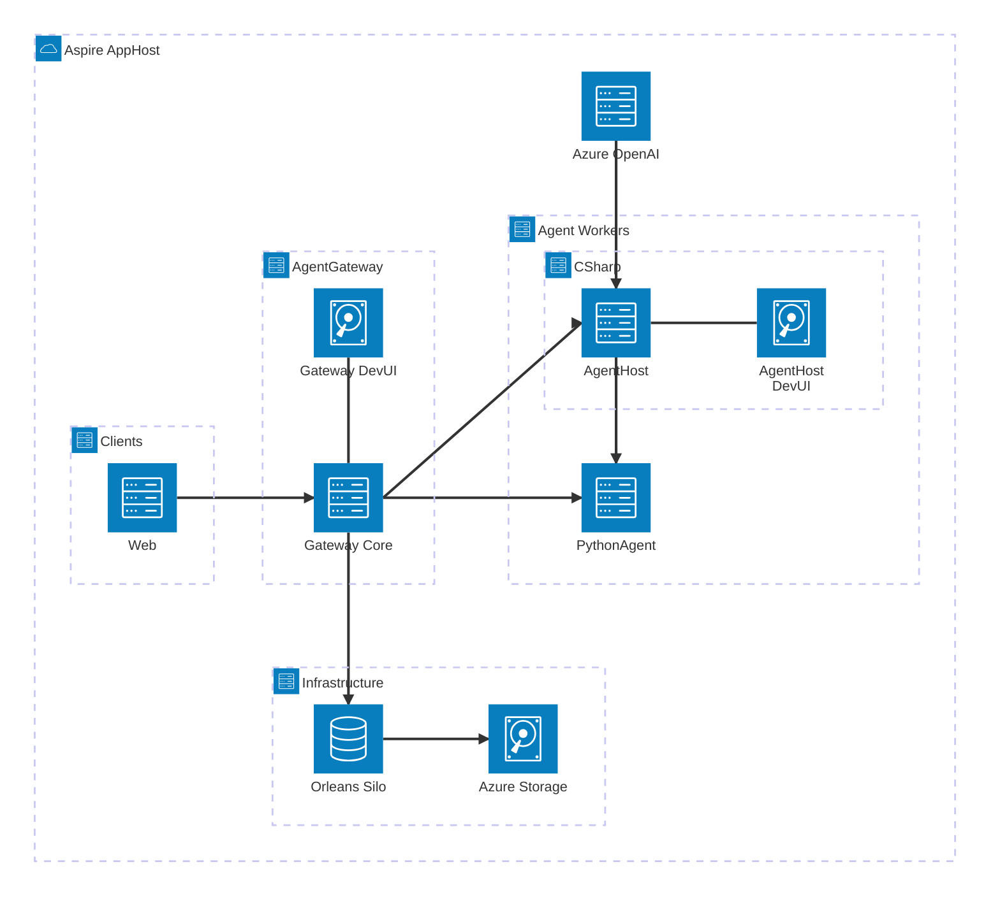

# AgentWebChat

A comprehensive reference implementation demonstrating production-ready AI agent infrastructure with multi-language support, durable workflows, and enterprise-grade protocol handling—orchestrated with .NET Aspire.

## Overview

AgentWebChat showcases how to build scalable, polyglot AI agent systems with:

- **🎯 .NET Aspire Orchestration** - Unified service orchestration, discovery, and observability
- **🌉 AI Agent Gateway** - Durable ingress layer handling OpenAI Responses/Conversations APIs, Agent-to-Agent (A2A), and other protocols
- **⚡ Durable Workflows** - Long-running, resumable agent operations with Orleans-backed state
- **🐍 Python Integration** - Reusable library for building Python agents that integrate seamlessly with .NET infrastructure
- **🛠️ DevUI** - Interactive web interface for testing and debugging agents during development
- **📊 Full Observability** - Built-in OpenTelemetry with GenAI semantic conventions

This sample demonstrates how to:
- Orchestrate multi-service AI systems with .NET Aspire
- Build agents that focus on business logic while the gateway handles protocol complexity
- Scale agent workloads across multiple worker processes (C# and Python)
- Implement durable, resumable workflows with state persistence
- Test and debug agents interactively with DevUI
- Integrate heterogeneous agent implementations in a unified system

## Architecture



**Flow:**
1. **Aspire AppHost** orchestrates all services (Orleans, Storage, OpenAI, Gateway, Workers, Clients)
2. **Clients** (Web Blazor, DevUI) send requests to **AgentGateway**
3. **AgentGateway** routes requests to workers:
   - **AgentHost** (C# agents & workflows)
   - **PythonAgent** (Python agents)
4. **AgentHost** can call **PythonAgent** via proxy for polyglot workflows
5. **Orleans** + **Azure Storage** provide durable state for Gateway
6. **Azure OpenAI** model shared across all workers

## Project Structure

```
AgentWebChat/
├── AgentWebChat.AppHost/          # ⭐ Aspire orchestration (START HERE)
├── AgentGateway/                  # Protocol gateway (ingress)
├── AgentWebChat.AgentHost/        # C# agents and workflows
├── PythonAgent/                   # Python agents (pig-latin, travel)
├── python-agent-worker/           # Reusable Python library
├── AgentWebChat.Web/              # Blazor web frontend
├── AgentContracts/                # Shared contracts
├── AgentWebChat.ServiceDefaults/  # Aspire service defaults
└── docs/                          # Additional documentation
```
1. **Aspire AppHost** orchestrates all services (Orleans, Storage, OpenAI, Gateway, Workers, Clients)
2. **Clients** (Web Blazor, DevUI) send requests to **AgentGateway**
3. **AgentGateway** routes requests to workers:
   - **AgentHost** (C# agents & workflows)
   - **PythonAgent** (Python agents)
4. **AgentHost** can call **PythonAgent** via proxy for polyglot workflows
5. **Orleans** + **Azure Storage** provide durable state for Gateway
6. **Azure OpenAI** model shared across all workers

## Project Components

### **AgentWebChat.AppHost** ⭐
.NET Aspire orchestration project - the entry point that configures and launches all services:
- **Service Discovery** - Automatic endpoint resolution between services
- **Azure OpenAI Integration** - Centralized model configuration shared across all agents
- **Storage Orchestration** - Azure Storage emulator for Orleans state and reminders
- **Python Worker Support** - Uvicorn app hosting with automatic dependency management (uv)
- **Telemetry Aggregation** - Unified OpenTelemetry collection across all services
- **Development Dashboard** - Aspire dashboard for monitoring all services, traces, and metrics

**Key Services Orchestrated:**
- `gateway` - Agent Gateway (ingress)
- `agenthost` - C# agent worker
- `python-agent` - Python agent worker
- `webfrontend` - Blazor web UI
- `orleans-silo` - Orleans cluster
- `storage` - Azure Storage emulator

**Start everything with:** `dotnet run --project AgentWebChat.AppHost/`

### **AgentGateway**
Production-ready ingress gateway implementing multiple AI agent protocols. Acts as a stateful intermediary between clients and worker applications, handling protocol complexity, streaming, durable execution, and worker routing.

**Protocols Implemented:**
- OpenAI Responses API (streaming with cursor resumption)
- OpenAI Conversations API (stateful persistence)
- Agent-to-Agent (A2A) protocol
- DevUI discovery and entity management

**Features:**
- Automatic worker discovery and health checks
- Orleans-backed durable execution (survives restarts)
- Stream caching for network resilience
- Stateful routing for consistent request handling

📖 **See:** [AgentGateway/README.md](AgentGateway/README.md) for detailed architecture and features.

### **DevUI** 🛠️
Interactive web-based development interface for testing and debugging agents. Available at both Gateway and AgentHost levels.

**Capabilities:**
- **Agent Discovery** - Automatically discovers all agents from registered workers
- **Interactive Testing** - Chat interface to test agents in real-time
- **Entity Management** - Browse and inspect all agents and workflows
- **Protocol Debugging** - View request/response events and streaming behavior
- **Multi-Protocol Support** - Test agents via different protocol modes

**Access Points:**
- **Gateway DevUI**: `http://localhost:<gateway-port>/devui` - **Primary testing interface** - aggregates all workers
- **AgentHost DevUI**: `http://localhost:<agenthost-port>/devui` - Local agents only

**💡 Best Practice:** Use **Gateway DevUI** as your primary testing interface. It provides the most complete view of all agents across all workers. The Web project may have issues, and AgentHost DevUI only shows local C# agents—proxy agents (like `HttpResponseProxyAgent` used for calling Python agents) are intentionally not discoverable in AgentHost DevUI by design.

DevUI enables rapid iteration during development—test agents without building a full client application.

### **AgentWebChat.AgentHost**
.NET worker application hosting production-ready C# agents and workflows. Registers with AgentGateway and exposes agents via DevUI.

**C# Agents:**
- **`pirate`** - Chat agent that speaks like a pirate (demonstrates basic agent with custom instructions)
- **`config-rollout`** (`ConfigRolloutAgent`) - Configuration rollout management agent
- **`chemist`** - Chemistry expert agent (used in workflows)
- **`mathematician`** - Mathematics expert agent (used in workflows)
- **`literator`** - Literature expert agent (used in workflows)
- **`story-writer`** - Creative story generation agent (used in polyglot workflow)

**Workflows:**
- **`science-sequential-workflow`** - Sequential workflow chaining chemist → mathematician → literator
- **`science-concurrent-workflow`** - Concurrent workflow running chemist, mathematician, literator in parallel
- **`polyglot-story-workflow`** - Cross-language workflow: C# story-writer → Python pig-latin-agent
- **`travel-journal-workflow`** - Cross-language workflow: Python travel-itinerary-agent → C# story-writer
- **`marketing-content` (HITL)** - Human-in-the-loop workflow with approval step:
  1. AI Writer generates content
  2. AI Reviewer refines content
  3. Human approval (pauses for input)

**Features:**
- Orleans-backed durability with conversation persistence
- Custom AI tools and function invocation
- HTTP proxy agents for calling remote Python agents (used in polyglot workflows)
- Workflow state management with Gateway integration

### **PythonAgent**
Python-based worker demonstrating cross-language agent integration using the `python-agent-worker` library.

**Python Agents:**
- **`pig-latin-agent`** - Text transformation to Pig Latin (demonstrates simple, synchronous logic)
- **`travel-itinerary-agent`** - Travel planning using Pydantic AI and Azure OpenAI (demonstrates AI framework integration)

**Integration:**
- Registers with AgentGateway on startup
- Callable from C# workflows via proxy agents
- Automatic OpenTelemetry instrumentation with GenAI semantic conventions

📖 **See:** [PythonAgent/README.md](PythonAgent/README.md) for setup and examples.

### **python-agent-worker**
Reusable Python library for building agents that integrate with AgentGateway. Reduces boilerplate by 80% by handling protocol compliance, event streaming, health checks, and OpenTelemetry instrumentation automatically.

**Library Features:**
- Abstract `WorkerAgent` base class (implement only `execute()` method)
- `Worker` orchestrator - FastAPI server handling routing, discovery, health checks, and telemetry
- Event streaming context manager (`EventStreamContext`)
- Built-in OpenTelemetry support with configurable AI framework instrumentation
- Protocol models for AgentGateway communication

📖 **See:** [python-agent-worker/README.md](python-agent-worker/README.md) for framework documentation.

### **AgentWebChat.Web**
Blazor Server interactive web frontend providing multi-protocol agent interaction capabilities.

**Features:**
- Streaming agent responses (OpenAI Responses API)
- Stateful chat sessions (OpenAI Conversations API)
- Agent-to-Agent communication demos
- Workflow execution and monitoring

### **AgentContracts**
Shared contracts and utilities for worker-gateway communication:
- Worker registration and discovery protocols
- Workflow state management abstractions
- Telemetry and monitoring contracts
- Resource metadata models

### **AgentWebChat.ServiceDefaults**
Shared service configuration for telemetry, health checks, and observability across all .NET components. Provides consistent configuration via .NET Aspire service defaults pattern.

## Key Features

### ✅ .NET Aspire Orchestration
- Single-command launch of entire distributed system
- Automatic service discovery and configuration
- Unified telemetry dashboard
- Built-in storage emulator support

### ✅ Multi-Protocol Support
- OpenAI Responses API with cursor-based stream resumption
- OpenAI Conversations API with automatic state persistence
- Agent-to-Agent (A2A) protocol for inter-agent communication
- DevUI for agent discovery and testing

### ✅ Durable Execution
- Long-running workflows survive gateway/worker restarts
- Orleans-backed state persistence
- Human-in-the-loop (HITL) workflow support with approval steps
- Automatic retry and recovery

### ✅ Polyglot Agents
- C# agents using Microsoft.Agents.AI
- Python agents using reusable framework
- Protocol-compliant integration regardless of language
- Cross-language workflows (C# ↔ Python)

### ✅ Developer Experience
- **DevUI** for interactive agent testing
- **Aspire Dashboard** for telemetry and monitoring
- **Hot reload** support for rapid iteration
- **Comprehensive documentation** and examples

### ✅ Production-Ready Observability
- OpenTelemetry distributed tracing across all components
- GenAI semantic conventions for AI-specific telemetry
- Aspire dashboard integration with traces, metrics, and logs
- Structured logging with trace correlation

## Getting Started

### Prerequisites
- .NET 9.0 SDK
- Python 3.12+ with [uv](https://docs.astral.sh/uv/)
- Azure OpenAI API access (or OpenAI API key)

### Quick Start

1. **Run the application:**
   ```bash
   cd AgentWebChat.AppHost
   dotnet run
   ```

2. **Configure Azure OpenAI** (first-time setup):
   - Open the **Aspire Dashboard** (opens automatically)
   - Navigate to the resources that need configuration
   - Set user secrets for Azure OpenAI connection via the dashboard

3. **Access the dashboards:**
   - **Aspire Dashboard** - Shows all services, traces, and metrics
   - **Gateway DevUI** - Click "Dev UI" link for gateway endpoint - **Primary testing interface**
   - **AgentHost DevUI** - Click "Dev UI" link for agenthost endpoint


### Development Workflow

- **Adding C# agents**: Extend [AgentWebChat.AgentHost/Program.cs](AgentWebChat.AgentHost/Program.cs) with new agent registrations
- **Adding Python agents**: Add agent classes in `PythonAgent/src/agents/` using the `python-agent-worker` library
- **Creating workflows**: Use `AgentWorkflowBuilder` to compose sequential or concurrent workflows
- **Testing**: Use DevUI at gateway level to test all agents interactively
- **Monitoring**: Use Aspire Dashboard to view distributed traces and metrics

## Documentation

- **[AgentGateway README](AgentGateway/README.md)** - Gateway architecture, protocols, and API reference
- **[python-agent-worker README](python-agent-worker/README.md)** - Python framework documentation and API
- **[PythonAgent README](PythonAgent/README.md)** - Python worker setup and agent examples
- **[docs/IMPLEMENTATION_SUMMARY.md](docs/IMPLEMENTATION_SUMMARY.md)** - Python framework implementation details
- **[docs/PYTHON_AGENT_WORKER_PRD_UPDATED.md](docs/PYTHON_AGENT_WORKER_PRD_UPDATED.md)** - Framework design rationale
- **[TODO.md](TODO.md)** - Observability and monitoring roadmap

## Testing

```bash
# Run all .NET tests
dotnet test

# Run Python framework tests
cd python-agent-worker
uv run pytest

# Test specific agent via DevUI
# 1. Start AppHost: dotnet run --project AgentWebChat.AppHost/
# 2. Open Gateway DevUI from Aspire Dashboard
# 3. Select agent and send test messages
```