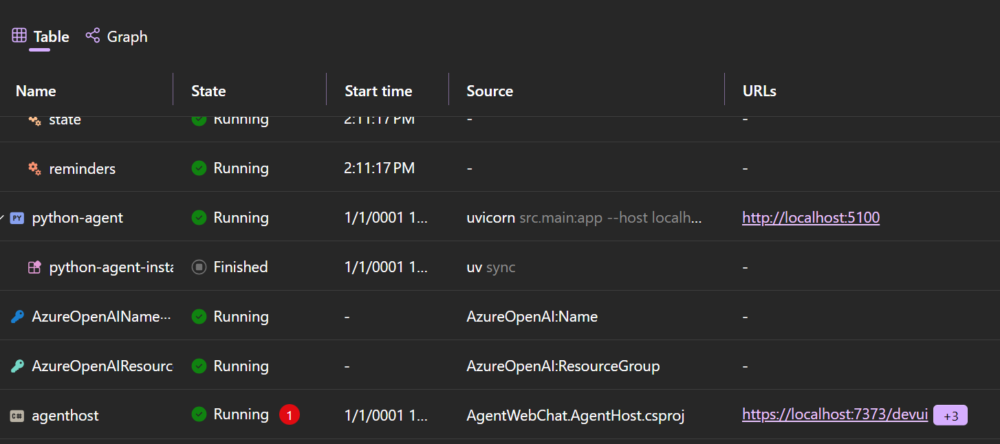

# Polyglot AI Agent Integration with Agent Gateway

## TLDR

This document describes adding polyglot agent support to the Agent Gateway, enabling Python and .NET agents to work together seamlessly. Key additions include:

- **python-agent-worker library**: Python package that abstracts protocol boilerplate (OpenAI Responses API, SSE streaming, telemetry) so developers just write business logic
- **HttpResponseProxyAgent**: C# proxy that makes remote Python agents callable from .NET workflows as if they were local agents
- **Two demo agents**: pig-latin-agent (no LLM, pure logic) and travel-itinerary-agent (Pydantic AI + Azure OpenAI), showing the gateway works for both AI and non-AI workloads
- **Cross-language workflows**: C# and Python agents composed into unified workflows using Agent Framework's workflow abstractions
- **Aspire orchestration**: Python workers get the same Aspire treatment as .NET projects (service discovery, health checks, telemetry, structured logs)

The result: teams can use their preferred language and AI framework for each agent while getting unified observability, durable execution, and workflow composition through .NET infrastructure. The gateway handles routing and protocol translation. Aspire handles orchestration. Developers focus on agent logic.

**What worked**: Gateway needed zero code changes. Aspire's Python support made orchestration straightforward. DevUI provided instant testing. Agent abstractions enabled transparent polyglot workflows.

**What needs work**: DevUI agent visibility controls, Aspire Dashboard trace unification for workflows, Aspire CLI startup timeouts, Python app endpoint configuration, and accurate resource start times.

**Future work**: Publish python-agent-worker to PyPI and AgentGateway as a NuGet package. Add `HttpResponseProxyAgent` to Agent Framework as a first-class primitive. Build agent-worker libraries for TypeScript/Node.js. Improve observability with unified traces and better cross-language error propagation. Create production deployment guides and how-to documentation.

**Future investigations**: Validate durable execution with polyglot agents. Explore gateway use for non-agent scenarios like ETL jobs or workflows needing human approval. Investigate deployment options (library, Aspire-orchestrated, standalone container). Design identity and access control patterns for agent authentication and authorization.

## Introduction

The Agent Gateway is a **durable ingress layer** for AI agents (meaning it keeps processes running even through failures and restarts). It handles protocol negotiation, streaming, and state management so agents can focus on business logic. If you want the full architecture details, check out the [Agent Gateway design doc](https://github.com/ReubenBond/agent-framework/blob/gateway/12/dotnet/samples/AgentWebChat/AgentGateway/README.md).

This writeup covers my experience extending the base Agent Gateway sample (`reuben/gateway/12`) to add polyglot agent support. Specifically, building Python agents that work with the gateway and composing them with .NET agents in cross-language workflows. The code lives in the [luisquintanilla/agent-drt GitHub repo](https://github.com/luisquintanilla/agent-drt) on the `feature/python-agent-integration` branch.

See the [AgentWebChat README](../README.md) for project overview, architecture diagrams, and how to run everything.

## What's in This Project

This sample builds upon the Agent Gateway version of the AgentWebChat project by adding polyglot capabilities. Here's an overview of what was added:

### Key Additions Compared to Base Project

Here's what got added to enable polyglot agent scenarios:

| Component | What Was Added | Why It Matters |
|-----------|---------------|----------------|
| **python-agent-worker library** | Reusable Python library with `WorkerAgent` base class, `Worker` orchestrator, `EventStreamContext` helpers, protocol models, and telemetry setup | Reduces boilerplate for endpoint registration, telemetry, SSE and other cross-cutting concerns.  This allows developers to focus on their business logic. |
| **PythonAgent worker** | Complete Python worker with two agents: `pig-latin-agent` (no LLM) and `travel-itinerary-agent` (Pydantic AI + Azure OpenAI) | Showcase flexibility of the gateway. The pig-latin agent is just Python code doing text transformation. No model calls, no tokens, no inference. The gateway treats it the same as the travel agent that uses Azure OpenAI. This matters because not every worker needs to make LLM calls. |
| **HttpResponseProxyAgent** | C# proxy that calls remote agents via the gateway's `/v1/responses` endpoint, handling SSE streaming and communication via the OpenAI Responses API | Makes polyglot workflows possible. .NET code can call Python agents as if they're local. This enables .NET developers to seamlessly integrate agents and capabilities developed in other stacks. |
| **Polyglot workflows** | Two cross-language workflows: `polyglot-story-workflow` (C# to Python) and `travel-journal-workflow` (Python to C#) | Shows how to mix agents regardless of language. C# story writer uses Python pig-latin translator. Python travel planner feeds C# story writer. Pick the right tool for each step. |
| **Aspire Python integration** | Leverage Aspire's Python integrations to orchestrate PythonAgent worker | Python workers get the same Aspire treatment as .NET projects: automatic startup, service discovery, health checks, logs,telemetry. |

### Why These Additions Matter

The whole point here is letting developers focus on solving actual problems with the tools they know best. The Agent Gateway takes care of durable execution. Aspire handles logs, telemetry, service discovery, and makes the inner dev loop tight. Both technologies are built in .NET, but they're not limited to .NET. The Python project additions to this project showcase that by having Python and .NET workers running side by side.

Want to use Python with Pydantic AI to build your AI Agents? Or maybe you prefer Agent Framework in .NET? The gateway doesn't care what you're running or how you built it. That means teams can pick the right tool for each agent while still getting .NET's infrastructure benefits.

The `python-agent-worker` library handles the Python side. It abstracts away cross-cutting concerns (endpoint registration, OpenAI Response API communication, SSE streaming, telemetry setup) so Python developers can just write their agent logic and quickly expose it to the gateway. On the .NET side, the `HttpResponseProxyAgent` acts as the glue, letting .NET workflows call Python agents transparently through the gateway. 

When building for production, productivity, performance, and reliability are what matter. You can continue using the stack you're already productive in, but the Agent Gateway and Aspire foundations these solutions run on are built using .NET, which delivers all three.

See the [AgentWebChat README](../README.md) for complete architecture diagrams and component descriptions.

## Motivations

The following were some of the primary motivations behind this exploration:

- I wanted to get hands-on with the Agent Gateway.
- Show that agents written in other languages can integrate seamlessly with the gateway. Opening the ecosystem to Python developers, TypeScript developers, etc.
- Show that agents don't need LLMs. The gateway is about agent orchestration, not AI orchestration. The `pig-latin-agent` is just regular Python code. It runs alongside the `travel-itinerary-agent` that does call Azure OpenAI. Both are treated the same by the gateway. This matters because you can mix expensive AI steps with non-AI steps in the same workflow.
- Show that the gateway also shouldn't lock you into one AI framework. When you do use LLMs, C# agents can use Microsoft.Agents.AI while Python agents use Pydantic AI. They coexist fine. And you can compose them into cross-language workflows.

## How It Works: Implementation Highlights

This section focuses on the key patterns introduced to enable polyglot agent integration.

### python-agent-worker Library Architecture

The `python-agent-worker` library reduces boilerplate for cross-cutting concerns. Here's how:

**Before (manual protocol handling):**
```python
# Every agent needs 50+ lines of protocol boilerplate
@app.post("/v1/responses")
async def create_response(request: CreateResponse):
    sequence_number = 0
    async def event_generator():
        nonlocal sequence_number
        try:
            yield StreamingResponseEvent(
                type="response.output_text.delta",
                sequence_number=sequence_number,
                delta="Hello"
            )
            sequence_number += 1
            yield StreamingResponseEvent(
                type="response.output_text.done",
                sequence_number=sequence_number,
                text="Hello"
            )
            # ... more boilerplate
```

**After (using python-agent-worker):**
```python
from agent_worker import WorkerAgent, EventStreamContext

class MyAgent(WorkerAgent):
    def __init__(self):
        super().__init__(
            name="my-agent",
            description="What my agent does"
        )
    
    async def execute(self, request, context: EventStreamContext):
        async with context:
            await context.emit_text("Hello")  # Framework handles events
```

Developers write significantly less code. The library handles sequence numbers, error conversion, streaming, and protocol compliance. They just implement the `execute` function focus on business logic.

### Worker Configuration and Discovery

Workers are configured statically in the gateway's appsettings.json. The gateway knows where to find each worker and calls their `/v1/entities` endpoint to discover available agents:

```json
// Gateway appsettings.Development.json
{
  "AgentGateway": {
    "Workers": [
      { "Endpoint": "http://localhost:5390" },  // AgentHost (.NET)
      { "Endpoint": "http://localhost:5100" }   // PythonAgent
    ]
  }
}
```

When the gateway starts:
1. Loads worker endpoints from config
2. Calls each worker's `/v1/entities` endpoint
3. Aggregates all agents into a unified catalog
4. Routes requests to the appropriate worker based on agent name

The Python worker exposes standard endpoints:

```python
# From PythonAgent/src/main.py
from agent_worker import Worker

worker = Worker(
    service_name="python-agent",
    title="Agent Worker",
    description="Python agent worker for AgentWebChat"
)

worker.register_agent(PigLatinAgent())
worker.register_agent(TravelItineraryAgent())

app = worker.app  # FastAPI app with /v1/entities, /v1/responses, /health
```

Aspire handles the service discovery. When you run via AppHost, the gateway automatically gets the correct endpoints for all workers. Python agents show up in DevUI next to .NET agents, receive requests through the same gateway, and get the same durable execution.

### Agents Without LLMs: The Pig-Latin Example

Not every agent needs AI. The pig-latin agent proves this:

```python
# From PythonAgent/src/agents/pig_latin.py
class PigLatinAgent(WorkerAgent):
    def __init__(self):
        super().__init__(
            name="pig-latin-agent",
            description="Translates English text to Pig Latin"
        )
    
    async def execute(self, request, context: EventStreamContext):
        input_text = request.input if isinstance(request.input, str) else ""
        
        async with context:
            # Just regular Python code - no model, no API calls
            result = translate_to_pig_latin(input_text)
            await context.emit_text(result)
```

No Azure OpenAI. No Pydantic AI. Just a function that moves letters around. The gateway doesn't care. It streams the output the same way it would stream from GPT-4.

This is important because workflows often need a mix of AI and non-AI steps. Generate text with an LLM, transform it with logic, validate with rules, format with templates. The gateway lets you compose these freely without treating AI steps as special.

### Polyglot Workflow Mechanics: HttpResponseProxyAgent

The `HttpResponseProxyAgent` enables .NET workflows to call remote agents (Python or otherwise) transparently:

```csharp
// From AgentWebChat.AgentHost/HttpResponseProxyAgent.cs
public sealed class HttpResponseProxyAgent : AIAgent
{
    private readonly HttpClient _httpClient;
    private readonly string _agentName;
    
    public override async IAsyncEnumerable<AgentRunResponseUpdate> RunStreamingAsync(
        IEnumerable<ChatMessage> messages,
        AgentThread? thread = null,
        AgentRunOptions? options = null,
        CancellationToken cancellationToken = default)
    {
        // Build OpenAI Responses API request
        var createRequest = new CreateResponse
        {
            Input = ResponseInput.FromMessages(inputMessages),
            Agent = new AgentReference { Name = this._agentName },
            Stream = true
        };
        
        // POST to gateway's /v1/responses endpoint
        var httpResponse = await this._httpClient.PostAsync("/v1/responses", ...);
        
        // Parse SSE stream and convert to AgentRunResponseUpdate
        await foreach (var line in ReadSseStream(httpResponse))
        {
            if (line.StartsWith("data: "))
            {
                var eventJson = line.Substring(6);
                var update = ConvertToAgentRunResponseUpdate(eventJson);
                yield return update;
            }
        }
    }
}
```

**Workflow usage:**
```csharp
// From AgentWebChat.AgentHost/Program.cs - Polyglot workflow
builder.AddProxyAgent("pig-latin-proxy", "pig-latin-agent", "GatewayClient");

var polyglotWorkflow = builder.AddWorkflow("polyglot-story-workflow", (sp, key) =>
{
    var agents = new AIAgent[]
    {
        sp.GetRequiredKeyedService<AIAgent>("story-writer"),      // C# agent
        sp.GetRequiredKeyedService<HttpResponseProxyAgent>("pig-latin-proxy")  // Python agent via proxy
    };
    
    return AgentWorkflowBuilder.BuildSequential(workflowName: key, agents: agents);
});
```

This proxy is what makes polyglot workflows work. From the workflow's view, the Python agent looks like any other `AIAgent`. The gateway deals with protocol translation, streaming, and errors. Without it, .NET workflows would be limited to .NET agents only.

### OpenTelemetry with GenAI Semantic Conventions

Both .NET and Python agents emit OpenTelemetry traces with GenAI semantic conventions, providing unified observability:

```python
# From python-agent-worker/agent_worker/telemetry.py
def setup_telemetry(service_name: str, otlp_endpoint: str):
    """Configure OpenTelemetry with GenAI semantic conventions."""
    resource = Resource.create({
        "service.name": service_name,
        "telemetry.sdk.language": "python"
    })
    
    provider = TracerProvider(resource=resource)
    provider.add_span_processor(
        BatchSpanProcessor(OTLPSpanExporter(endpoint=otlp_endpoint))
    )
    
    # Instrument FastAPI automatically
    FastAPIInstrumentor().instrument()
    
    # Instrument Pydantic AI (if available) for GenAI semantic conventions
    try:
        from pydantic_ai.opentelemetry import configure_opentelemetry
        configure_opentelemetry()  # Adds gen_ai.* attributes
    except ImportError:
        pass
```

Distributed traces span C# and Python agents. 

## Personas and User Flows

This section walks through concrete scenarios showing how different developers interact with the polyglot agent system. Each persona represents a common use case with step-by-step flows.

### Persona 1: Python Developer Exposing AI Agents

As a Python developer, I want to expose my AI agents through the Agent Gateway so that they can be discovered and used in workflows alongside other agents in my organization.

#### User Flow

1. **Install the python-agent-worker library:**
   ```bash
   cd python-agent-worker
   uv sync
   ```

2. **Create an agent by extending `WorkerAgent`:**
   ```python
   from agent_worker import WorkerAgent, EventStreamContext
   
   class TravelAgent(WorkerAgent):
       def __init__(self):
           super().__init__(
               name="travel-itinerary-agent",
               description="Plans travel itineraries using AI"
           )
       
       async def execute(self, request, context: EventStreamContext):
           # Extract input
           input_text = request.input if isinstance(request.input, str) else ""
           
           async with context:
               # Your business logic here - use any AI framework
               result = await plan_trip(input_text)
               await context.emit_text(result)
   ```

3. **Configure and run the worker:**
   ```python
   from agent_worker import Worker, setup_telemetry
   
   setup_telemetry("my-agent-worker", otlp_endpoint="http://localhost:4317")
   
   worker = Worker(
       host="0.0.0.0",
       port=5100,
       gateway_url="http://localhost:5390",
       host_id="my-worker-1"
   )
   
   worker.add_agent(TravelAgent())
   worker.run()
   ```

4. **Verify in Gateway DevUI:**
   - Open `http://localhost:5390/devui`
   - See your agent listed automatically
   - Test it interactively with sample inputs

#### How Key Additions Help

The python-agent-worker library cuts out boilerplate. You only write the `execute()` method. Workers register with the gateway automatically when they start. Your agents show up in DevUI immediately without configuration. OpenTelemetry with GenAI semantic conventions gets set up for you. And you can use any AI framework you want: Pydantic AI, LangChain, OpenAI SDK, whatever.

### Persona 2: .NET Developer Using Cross-Stack Agents

As a .NET developer, I want to build workflows that use agents written in different languages so that I can leverage the best tools for each step regardless of the implementation language.

#### User Flow

1. **Reference the gateway HttpClient in your worker's DI:**
   ```csharp
   builder.Services.AddHttpClient("GatewayClient", client =>
   {
       client.BaseAddress = new Uri("http://localhost:5390");
   });
   ```

2. **Register a proxy agent for the Python agent:**
   ```csharp
   // From AgentWebChat.AgentHost/ProxyAgentExtensions.cs
   builder.AddProxyAgent(
       proxyKey: "pig-latin-proxy",
       targetAgentName: "pig-latin-agent",  // Python agent name
       httpClientName: "GatewayClient"
   );
   ```

3. **Compose a polyglot workflow:**
   ```csharp
   var workflow = builder.AddWorkflow("polyglot-story-workflow", (sp, key) =>
   {
       var agents = new AIAgent[]
       {
           sp.GetRequiredKeyedService<AIAgent>("story-writer"),  // C# agent
           sp.GetRequiredKeyedService<HttpResponseProxyAgent>("pig-latin-proxy")  // Python agent
       };
       
       return AgentWorkflowBuilder.BuildSequential(
           workflowName: key,
           agents: agents
       );
   });
   ```

4. **Test and monitor:**
   - Open Gateway DevUI at `http://localhost:5390/devui`
   - Select your workflow from the agent list
   - Send test messages and watch both C# and Python agents execute in sequence
   - View distributed traces in Aspire Dashboard showing the full cross-language flow

#### How Key Additions Help

`HttpResponseProxyAgent` makes remote agent calls look like local ones. Python agents work like any `AIAgent` instance. The gateway handles discovery, health checks, and request forwarding. Both C# and Python agents stream events in the same format. Proxy agents work with existing workflow patterns. No special code needed.

### Persona 3: Operator Configuring Enterprise Agents

As an operator, I want to manage agents across my organization so that I have centralized control and visibility over all agent deployments regardless of their implementation language.

#### User Flow

Workers are configured statically in the gateway's configuration:

1. **Configure workers in gateway's appsettings.json:**
   ```json
   {
     "AgentGateway": {
       "Workers": [
         {
           "Endpoint": "http://localhost:5390",
           "HostId": "dotnet-worker-1",
           "HealthPath": "/health",
           "DiscoveryPath": "/v1/entities"
         },
         {
           "Endpoint": "http://localhost:5100",
           "HostId": "python-worker-1",
           "HealthPath": "/health",
           "DiscoveryPath": "/v1/entities"
         }
       ]
     }
   }
   ```

2. **Gateway loads workers on startup:**
   ```csharp
   // From AgentGateway/WorkerRegistry.cs constructor
   var workers = options.Value.Workers;
   for (int i = 0; i < workers.Count; i++)
   {
       var worker = workers[i];
       var workerInfo = new WorkerInfo(
           worker.Endpoint,
           worker.HostId,
           new Uri(worker.Endpoint, UriKind.Absolute),
           worker.HealthPath,
           worker.DiscoveryPath,
           IsDefault: i == 0
       );
       
       this._entries[id] = new Entry(workerInfo, DateTimeOffset.UtcNow);
   }
   ```

3. **Gateway aggregates agents from all workers:**
   ```csharp
   // From AgentGateway/WorkerRegistryEntityProvider.cs
   public async IAsyncEnumerable<AgentDescriptor> GetEntitiesAsync(...)
   {
       foreach (var worker in registry.ActiveWorkers)
       {
           // Call each worker's /v1/entities endpoint
           var entities = await httpClient.GetFromJsonAsync<EntitiesResponse>(
               new Uri(worker.Endpoint, worker.DiscoveryPath)
           );
           
           foreach (var entity in entities.Entities)
           {
               yield return new AgentDescriptor(
                   entity.Id,
                   entity.Name,
                   entity.Description
               );
           }
       }
   }
   ```

4. **View unified catalog in Gateway DevUI:**
   - Open `http://localhost:5390/devui`
   - See all agents from all workers (.NET + Python)
   - Test any agent directly
   - Monitor health status

5. **Gateway runs periodic health checks:**
   - Hits each worker's `/health` endpoint every 30 seconds
   - Marks workers as down if health check fails
   - Removes unhealthy workers from routing

#### How Key Additions Help

Workers are configured in one place (gateway's appsettings.json). WorkerRegistry tracks all workers and their health. WorkerRegistryEntityProvider pulls agents from every worker into one catalog. Gateway DevUI gives you a single view of all agents regardless of language. Health checks run automatically. When using Aspire, service discovery handles endpoint resolution automatically.

You manage everything through one gateway. Workers register through config, and the gateway handles discovery and health monitoring.

## Key Learnings

### What worked

- **The Gateway worked out of the box.** I didn't need to modify the gateway codebase at all. It already supported everything I needed for my scenarios. Since it supports multiple protocols I picked OpenAI Responses API for my Python agents to accept requests. Python and C# agents integrated without any friction.
- **Aspire's Python integration simplified orchestration.** Configuring and running everything from one place was straightforward. The Python integration made it easy to pass in configuration like gateway URLs, Azure OpenAI endpoints, and other startup info my Python app needed. Once integrated, I was also able to leverage Aspire's rich telemetry and structured logs in the dashboard. 
- **Aspire MCP Server helped with debugging.** Debugging distributed systems is tough, but the Aspire MCP Server let me feed logs and telemetry into GitHub Copilot to track down issues faster. Being able to ask an AI assistant about what was happening in my system saved time.
- **DevUI made testing quick.** Once I got things wired up correctly, DevUI was great for testing Python agents and workflows interactively. No need to write custom UI or spin up separate clients.
- **AIAgent abstractions enabled polyglot workflows.** The flexibility of these abstractions let me write `HttpResponseProxyAgent` to expose Python agents to .NET apps. Treating remote Python agents like local .NET agents in Agent Framework workflows just worked.

### What didn't work as expected

#### Aspire CLI Startup Timeout Errors

##### Issue

Running Aspire CLI `aspire run` throws timeout errors

```text
aspire run
❌  An unexpected error occurred: The JSON-RPC connection with the remote party was lost before the request could 
complete.
Using launch settings from 
/home/luquinta/dev/agent-drt/dotnet/samples/AgentWebChat/AgentWebChat.AppHost/Properties/launchSettings.json...
warn: Microsoft.AspNetCore.Server.Kestrel.Core.KestrelServer[[9]]
      The ASP.NET Core developer certificate is only trusted by some clients. For information about trusting the ASP.NET 
Core developer certificate, see https://aka.ms/aspnet/https-trust-dev-cert
info: Aspire.Hosting.DistributedApplication[[0]]
      Aspire version: 13.0.0+7512c2944094a58904b6c803aa824c4a4ce42e11
info: Aspire.Hosting.DistributedApplication[[0]]
      Distributed application starting.
info: Aspire.Hosting.DistributedApplication[[0]]
      Application host directory is: /home/luquinta/dev/agent-drt/dotnet/samples/AgentWebChat/AgentWebChat.AppHost
info: Aspire.Hosting.Azure.Provisioning.Internal.DefaultTokenCredentialProvider[[0]]
      Using DefaultAzureCredential for provisioning.
fail: Microsoft.Extensions.Hosting.Internal.Host[[11]]
      Hosting failed to start
      System.Threading.Tasks.TaskCanceledException: A task was canceled.
         at Microsoft.AspNetCore.Server.Kestrel.Core.KestrelServerImpl.BindAsync(CancellationToken cancellationToken)
         at Microsoft.AspNetCore.Server.Kestrel.Core.KestrelServerImpl.StartAsync[[TContext]](IHttpApplication`1 
application, CancellationToken cancellationToken)
         at Microsoft.AspNetCore.Hosting.GenericWebHostService.StartAsync(CancellationToken cancellationToken)
         at Microsoft.Extensions.Hosting.Internal.Host.<StartAsync>b__14_1(IHostedService service, CancellationToken 
token)
         at Microsoft.Extensions.Hosting.Internal.Host.ForeachService[[T]](IEnumerable`1 services, CancellationToken 
token, Boolean concurrent, Boolean abortOnFirstException, List`1 exceptions, Func`3 operation)
fail: Microsoft.Extensions.Hosting.Internal.Host[[11]]
      Hosting failed to start
      System.Threading.Tasks.TaskCanceledException: A task was canceled.
         at Microsoft.AspNetCore.Server.Kestrel.Core.KestrelServerImpl.BindAsync(CancellationToken cancellationToken)
         at Microsoft.AspNetCore.Server.Kestrel.Core.KestrelServerImpl.StartAsync[[TContext]](IHttpApplication`1 
application, CancellationToken cancellationToken)
         at Microsoft.AspNetCore.Hosting.GenericWebHostService.StartAsync(CancellationToken cancellationToken)
         at Microsoft.Extensions.Hosting.Internal.Host.<StartAsync>b__14_1(IHostedService service, CancellationToken 
token)
         at Microsoft.Extensions.Hosting.Internal.Host.ForeachService[[T]](IEnumerable`1 services, CancellationToken 
token, Boolean concurrent, Boolean abortOnFirstException, List`1 exceptions, Func`3 operation)
         at Microsoft.Extensions.Hosting.Internal.Host.StartAsync(CancellationToken cancellationToken)
         at 
Aspire.Hosting.Dashboard.DashboardServiceHost.Microsoft.Extensions.Hosting.IHostedService.StartAsync(CancellationToken 
cancellationToken) in /_/src/Aspire.Hosting/Dashboard/DashboardServiceHost.cs:line 205
         at Microsoft.Extensions.Hosting.Internal.Host.<StartAsync>b__14_1(IHostedService service, CancellationToken 
token)
         at Microsoft.Extensions.Hosting.Internal.Host.ForeachService[[T]](IEnumerable`1 services, CancellationToken 
token, Boolean concurrent, Boolean abortOnFirstException, List`1 exceptions, Func`3 operation)
info: Aspire.Hosting.Azure.Provisioning.Internal.RunModeProvisioningContextProvider[[0]]
      Default subscription: luquinta dev subscription (/subscriptions/5c052600-a395-4b97-b4bf-e7905d98391b)
info: Aspire.Hosting.Azure.Provisioning.Internal.RunModeProvisioningContextProvider[[0]]
      Tenant: 72f988bf-86f1-41af-91ab-2d7cd011db47
info: Aspire.Hosting.Azure.Provisioning.Internal.RunModeProvisioningContextProvider[[0]]
      Using existing resource group luquinta-aoai-rg.
info: Aspire.Hosting.Pipelines.Internal.UserSecretsDeploymentStateManager[[0]]
      Azure resource connection strings saved to user secrets.
Unhandled exception. System.AggregateException: One or more errors occurred. (A task was canceled.)
 ---> System.Threading.Tasks.TaskCanceledException: A task was canceled.
   at System.Threading.Tasks.Task.GetExceptions(Boolean includeTaskCanceledExceptions)
   at System.Threading.Tasks.Task.ThrowIfExceptional(Boolean includeTaskCanceledExceptions)
   at System.Threading.Tasks.Task.Wait(Int32 millisecondsTimeout, CancellationToken cancellationToken)
   at System.Threading.Tasks.Task.Wait()
   at Aspire.Hosting.DistributedApplication.Run() in /_/src/Aspire.Hosting/DistributedApplication.cs:line 471
   at Program.<Main>$(String[[]] args) in 
/home/luquinta/dev/agent-drt/dotnet/samples/AgentWebChat/AgentWebChat.AppHost/Program.cs:line 67
--- End of stack trace from previous location ---

   --- End of inner exception stack trace ---
   at System.Threading.Tasks.Task.ThrowIfExceptional(Boolean includeTaskCanceledExceptions)
   at System.Threading.Tasks.Task.Wait(Int32 millisecondsTimeout, CancellationToken cancellationToken)
   at System.Threading.Tasks.Task.Wait()
   at Aspire.Hosting.DistributedApplication.Run() in /_/src/Aspire.Hosting/DistributedApplication.cs:line 471
   at Program.<Main>$(String[[]] args) in 
/home/luquinta/dev/agent-drt/dotnet/samples/AgentWebChat/AgentWebChat.AppHost/Program.cs:line 67
```

##### Workaround

Run the app using `dotnet run`

##### Expectation

App starts succesfully without timing out

#### Incorrect start time Aspire dashboard 

##### Issue

The Aspire Dashboard displays incorrect start times for resources. The timestamps shown don't reflect when resources actually started.



##### Workaround

None

##### Expectation

The Aspire Dashboard should display accurate start times for all resources that match when they actually became available.

#### HTTP Endpoint automatically set for uvicorn apps

##### Issue

Aspire runs the following command to start uvicorn apps.

`/home/luquinta/dev/agent-drt/dotnet/samples/AgentWebChat/PythonAgent/.venv/bin/uvicorn src.main:app --host localhost --port {{- portForServing "python-agent" -}} --reload`

It's unclear how portForService should be set.

Setting the port with `WithHttpEndpoint` 

```csharp
var pythonAgent = builder.AddUvicornApp(
    "python-agent",
    "../PythonAgent",
    "src.main:app")
    .WithUv()
    .WithHttpEndpoint(5100, name: "http")
    .WithReference(chatModel)
    .WaitFor(chatModel)
    .WithEnvironment("GATEWAY_URL", gateway.GetEndpoint("http"))
    .WithEnvironment("MODEL_NAME", chatModelName)
    .WithEnvironment("AZURE_OPENAI_ENDPOINT", $"https://{azOpenAiResource}.openai.azure.com/");
```

throws an error

```text
Unhandled exception. Aspire.Hosting.DistributedApplicationException: Endpoint with name 'http' already exists. Endpoint name may not have been explicitly specified and was derived automatically from scheme argument (e.g. 'http', 'https', or 'tcp'). Multiple calls to WithEndpoint (and related methods) may result in a conflict if name argument is not specified. Each endpoint must have a unique name. For more information on networking in Aspire see: https://aka.ms/dotnet/aspire/networking
   at Aspire.Hosting.ResourceBuilderExtensions.WithEndpoint[T](IResourceBuilder`1 builder, Nullable`1 port, Nullable`1 targetPort, String scheme, String name, String env, Boolean isProxied, Nullable`1 isExternal, Nullable`1 protocol) in /_/src/Aspire.Hosting/ResourceBuilderExtensions.cs:line 847
   at Aspire.Hosting.ResourceBuilderExtensions.WithHttpEndpoint[T](IResourceBuilder`1 builder, Nullable`1 port, Nullable`1 targetPort, String name, String env, Boolean isProxied) in /_/src/Aspire.Hosting/ResourceBuilderExtensions.cs:line 901
   at Program.<Main>$(String[] args) in /home/luquinta/dev/agent-drt/dotnet/samples/AgentWebChat/AgentWebChat.AppHost/Program.cs:line 28
```

##### Workaround

Override port using callback

```csharp
.WithEndpoint("http", endpoint => endpoint.Port = 5100)
```

##### Expectation

`WithHttpEndpoint` should work for uvicorn apps without throwing duplicate endpoint errors, allowing port configuration the same way it works for other Aspire resources.

#### Single unified trace across gateway worker requests / workflows

##### Issue

When executing workflows that involve multiple workers (e.g., a .NET agent calling a Python agent through the gateway), each step appears as a separate, disconnected trace in the Aspire Dashboard. This makes it difficult to understand the complete workflow execution path and see how long the entire workflow took from start to finish.


##### Workaround

Manually filter Agent Gateway POST HTTP requests in Aspire dashboard and look for traces that occur around the same time.  

##### Expectation

Workflows should display as a single unified trace in the Aspire Dashboard, showing the complete request flow from the initial workflow invocation through all agent executions. This would make it easy to:
- See the total workflow duration
- Understand the execution order and timing of each agent
- Identify performance bottlenecks across the entire workflow
- Debug failures by seeing exactly where in the workflow chain they occurred

#### Can't hide or selectively expose agents in DevUI

##### Issue

I want to be able to register an agent using dependeincy injection for use in workflows, but don't want to expose the agent in DevUI. 

##### Workaround

Register the agent using `AddKeyedSingleton` with the concrete type instead of `AddAIAgent()`:

```csharp
// Instead of using AddAIAgent which exposes to DevUI:
// builder.AddProxyAgent("my-proxy", "remote-agent", httpClientName: "GatewayClient");

// Register directly with concrete type to hide from DevUI:
builder.Services.AddKeyedSingleton("my-proxy", (sp, key) =>
{
    var httpClientFactory = sp.GetRequiredService<IHttpClientFactory>();
    var httpClient = httpClientFactory.CreateClient("GatewayClient");
    
    return new HttpResponseProxyAgent(
        httpClient: httpClient,
        agentName: "remote-agent",
        description: "Internal proxy agent"
    );
});

// Use it in workflows by requesting the concrete type:
var workflow = builder.AddWorkflow("my-workflow", (sp, key) =>
{
    var agents = new AIAgent[]
    {
        sp.GetRequiredKeyedService<AIAgent>("visible-agent"),
        sp.GetRequiredKeyedService<HttpResponseProxyAgent>("my-proxy") // Not in DevUI
    };
    
    return AgentWorkflowBuilder.BuildSequential(key, agents);
});
```

##### Expectation

Since `HttpResponseProxyAgent` inherits from `AIAgent`, I should be able to register it using `AddAIAgent()` just like any other agent. Registration via `AddAIAgent()` and visibility in DevUI are separate concerns. There should be a way to control whether an agent appears in DevUI, either through:
- A flag parameter in `AddAIAgent()` (e.g., `visible: false`)
- An attribute or property on the agent itself that DevUI respects
- Configuration in DevUI to filter which agents to display

This is likely more of a DevUI concern than a registration concern. Agents should be registered consistently through the framework, while DevUI should have the flexibility to determine which agents to surface in its UI.

### Additional Insights

## Future Work

Polyglot agent integration works. Here's what makes sense next:

### Agent Framework

- Add `HttpResponseProxyAgent` as a first-class primitive instead of keeping it in sample code
- Create an `HttpProxyAgent` abstraction with protocol-specific implementations (A2A, MCP, OpenAI Responses API) that follow the same design as `HttpResponseProxyAgent`: accepting an HttpClient, target agent name, and handling protocol translation transparently

### Python Agent Worker Library

- Publish to PyPI as a stable package (`pip install agent-worker`)
- Add A2A and MCP protocol support beyond OpenAI Responses API
- Improve error messages and debugging experience for Python developers

### Additional Language Support

- Build agent-worker libraries for TypeScript/Node.js following the same design as python-agent-worker: gateway registration, endpoint configuration, abstracting protocol boilerplate, handling SSE streaming, automatic telemetry setup

### Agent Gateway Distribution

- Publish AgentGateway as a NuGet package for easy integration. This enables embedding gateway functionality in applications as a library and more fine-grained customizations.
- Provide containerized deployment options for standalone scenarios

### Observability & Debugging

- Unify distributed traces across gateway and workers into single trace views in Aspire Dashboard
- Improve cross-language error propagation and stack traces
- Add correlation IDs that flow through the entire request chain

### Developer Experience

- Fix DevUI agent visibility control policies (allow hiding agents)
- Show agent attribution in Aspire dashboard AI telemetry UI. When workflows execute with multiple agents, the flow should display which specific agent generated each message instead of generic "User/Assistant" labels. This would make it easier to understand workflow execution flow and debug multi-agent interactions.
- Improve Aspire Python integration endpoint configuration (`WithHttpEndpoint` should work consistently)
- Resolve Aspire CLI timeout issues on startup
- Resolve Start Time issues in Aspire dashboard

### Documentation & Guidance

- Create deployment guides for production scenarios (containerized gateway, worker orchestration, scaling strategies)
- Write how-to guides for cross-language agentic workflows similar to the persona flows in this document
- Document best practices for protocol selection, error handling, and telemetry

### Sample Cleanup

- Once python-agent-worker and AgentGateway are published as packages, refactor the sample to consume them as dependencies rather than including the source code directly

## Future Investigations

- **Durable execution** - This exploration focused on Python integration and routing, but didn't test durable execution. Since durable execution is a core value proposition of the Agent Gateway, validating that it works correctly with polyglot agents is critical for production use.
- **Non-agent scenarios** - The gateway's capabilities extend beyond AI agents. Since it handles routing and durable execution for any worker, it could be useful for long-running processes like ETL jobs, AI training pipelines, workflows that need human approval steps, or any other workflow where the features the gateway provides are desirable. The pig-latin agent hints at this possibility. It doesn't use an LLM, but it still communicates using the OpenAI Responses API, so it's still treated as an agent application. What if the gateway supported a generic protocol for non-AI workloads? A standard endpoint for "generic" worker requests could expand the gateway's utility beyond agent orchestration. This broader applicability needs further exploration.
- **Deployment options** - The gateway could be deployed in different ways depending on the scenario. Options include embedding it as a library within applications, orchestrating it with Aspire, or running it standalone as a containerized service that teams can use without downloading and configuring NuGet packages. Each approach has trade-offs worth investigating.
- **Identity and access control** - The gateway should handle authentication and authorization for agents, but this hasn't been explored yet. Key questions include: How do agents authenticate to the gateway? How does the gateway verify an agent's identity? How do you control which agents can access specific resources or call other agents? These identity concerns need further investigation.